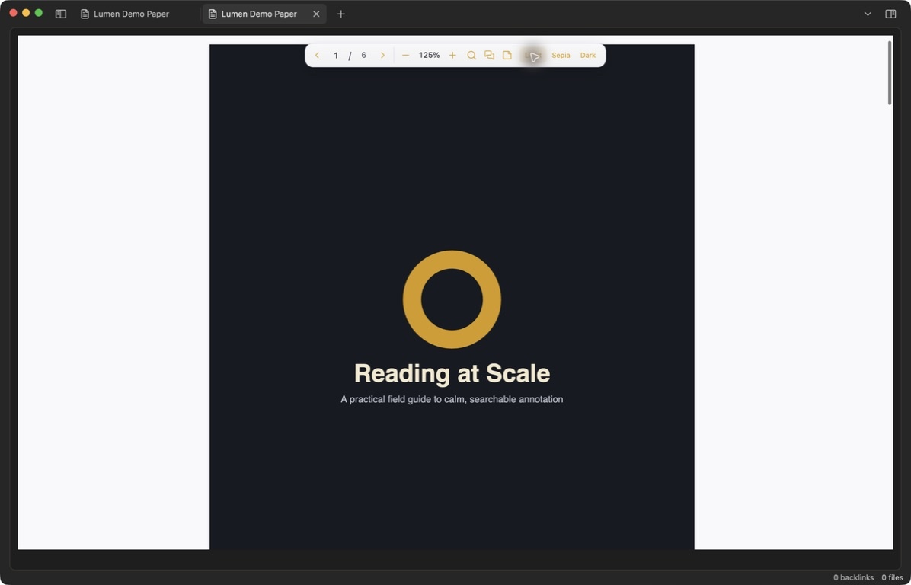
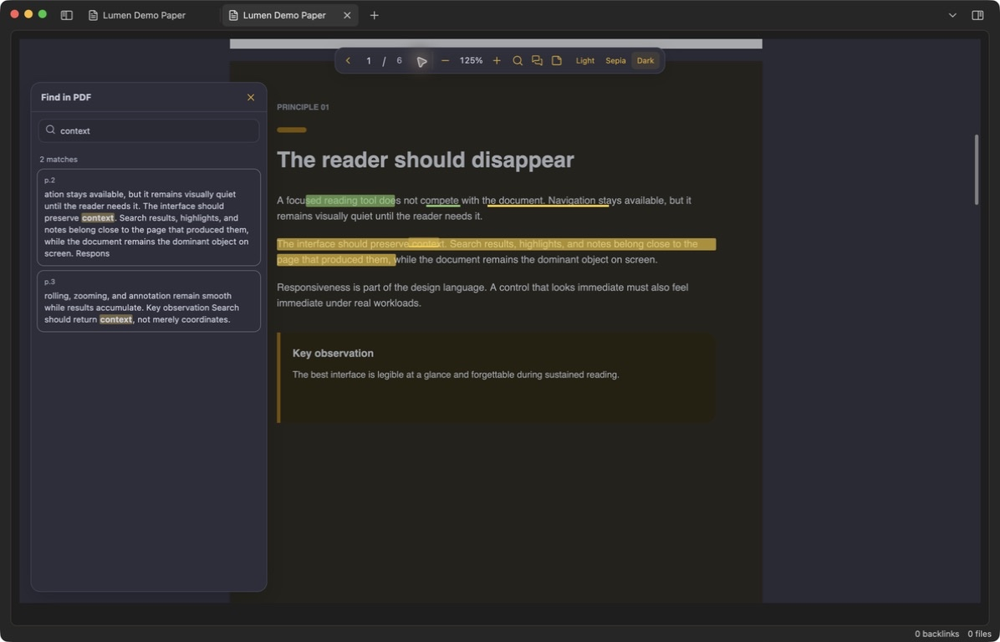
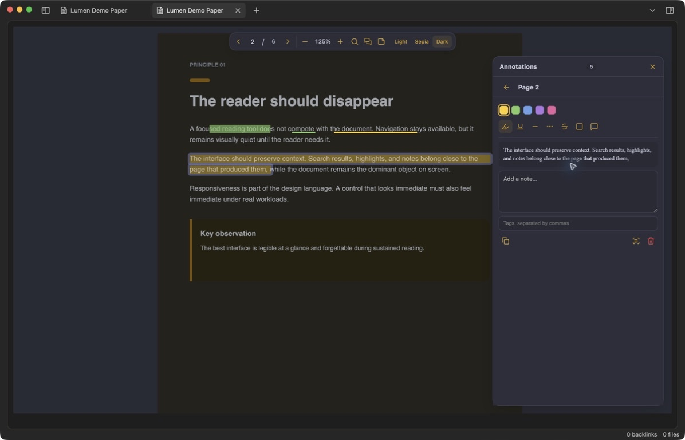
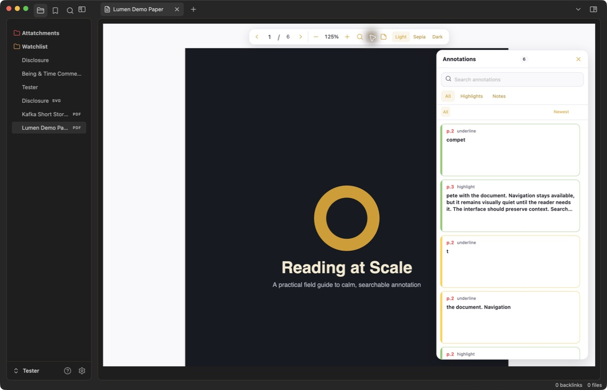
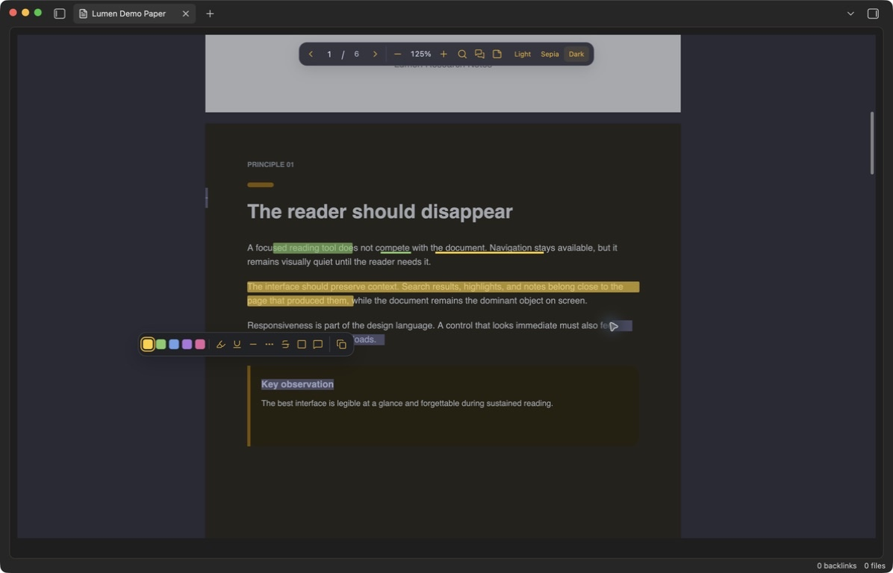

# Lumen PDF Annotator

Read, search, highlight, and annotate PDFs inside Obsidian with a calm interface designed to stay out of the document's way.



Lumen is a desktop-first PDF reader for research-heavy vaults. It combines document themes, contextual full-PDF search, fast text markup, searchable notes, and local recovery files without modifying the source PDF or sending its contents anywhere.

## What it feels like

- A compact floating toolbar with direct page entry, nearby previous/next controls, zoom, search, annotations, and light/sepia/dark themes.
- An immediate selection palette—no hover step—where choosing a colour prepares the mark and choosing its type applies it. Seven mark types are included: highlight, underline, dashed underline, dotted underline, strike-through, box, and comment.
- A floating PDF search that shows long, left-aligned excerpts so results make sense before you open them.
- A virtualized annotation inspector with bright colour edges, readable quotes, notes, and one-click navigation.
- A full editor for each saved mark, including colour, style, note, tags, copy, and delete.
- Right-click any saved highlight to copy a Markdown link that opens its PDF, page, and exact annotation from another note.
- Extend an existing text annotation from its editor; additional selections can be on the same page, a different page, or span a page boundary while remaining one logical annotation.
- Click-to-place page notes, readable exports, checksum verification, and recovery from the local PDF backup.

| Contextual PDF search | Individual annotation editor |
| --- | --- |
|  |  |





The screenshots show the running plugin in Obsidian using an original demo document created for this repository.

## Performance by construction

Lumen was built around large documents and dense annotation sets rather than optimized after the fact.

- Only pages near the viewport receive a canvas and selectable text layer; distant pages remain lightweight shells. Page mounts are capped at two concurrent jobs, and leaving the render window releases the canvas, text layer, PDF page proxy, and completed task references.
- Canvas rendering is capped at 12 million pixels to avoid runaway memory use at extreme zoom levels.
- Annotation lookups use ID and page indexes, so drawing a page does not scan the entire collection.
- Pages with unusually dense markup switch to one bounded canvas overlay with a spatial click index instead of creating thousands of DOM nodes.
- The inspector mounts only the visible card window plus overscan. Its default newest/oldest views request that window directly from a recency index instead of rebuilding the full logical collection after every edit.
- Full-document search yields to Obsidian every six pages, can be cancelled, bounds retained results and mounted cards, and uses a bounded least-recently-used page-text cache.
- Selection capture and current-page tracking use page-range/binary lookup rather than walking every page, while hidden search and inspector panels release their result DOM.
- Snapshot restore, annotation journals, and compact checkpoint serialization yield in bounded batches so six-figure loads and saves do not monopolize the UI thread. Closing or switching a PDF flushes only recent journal changes rather than rebuilding the entire snapshot.
- Stable PDF metadata caches the content hash so unchanged large files are not re-hashed on every open. Optional recovery copies run in the background and are disabled by default to avoid cloud-vault sync pressure.
- Each open PDF receives its own bundled, version-matched PDF.js worker.

A private synthetic benchmark used during 1.0.5 development inserted and search-indexed 100,000 annotations across 1,000 pages in 209.77 ms, traversed every page bucket in 12.80 ms, and searched all annotations in 18.13 ms on the development machine. A separate extreme run indexed 250,000 annotations across 2,000 pages in 576.63 ms, applied 10,000 edits in 72.80 ms, fetched a 12-card inspector window from the middle of the collection in 6.99 ms, traversed all page buckets in 34.76 ms, filtered the full collection in 60.07 ms, and sorted it in 10.76 ms. Those figures describe the in-memory index. A 100,000-record storage run restored the compact snapshot in 550.01 ms while returning to the host between 1,000-record batches, then produced a 28.24 MB compact checkpoint in 252.40 ms.

The production bundle was also exercised inside Obsidian 1.13.7 with a synthetic 3,000-page PDF. The first page painted in under a second; jumps to pages 1,500 and 3,000 returned to 0% idle CPU; twelve rapid distant-page jumps completed in 3.77 seconds; and the process settled between roughly 62 MB and 84 MB resident memory instead of growing with every visited page. A rare full-document search reached and highlighted its only match on page 3,000 while yielding control throughout. Results vary by machine and document, but the numbers make the intended scale concrete.

## Local, recoverable storage

The source PDF is never edited. Lumen hashes its bytes with SHA-256 and stores a recoverable bundle in your vault:

```text
.lumen-pdf/
  bundles/
    sha256/
      <document-hash>/
        manifest.json
        annotations.snapshot.json
        annotations.snapshot.previous.json
        annotations.journal.jsonl
        document.pdf  # only when automatic recovery copies are enabled
  file-index/
    <path-key>.json
```

The append-only JSONL journal protects recent changes between checkpoints, while the previous compact snapshot provides a recovery fallback. The export command creates a readable Markdown representation whenever you want one. Existing Markdown snapshots remain supported as migration and corruption fallbacks. Because identity comes from PDF content, annotations remain associated when the original file is renamed or moved.

Everything stays in the vault: no account, telemetry, remote processing, CDN scripts, or dynamic code loading.

## Install

### Obsidian Community Plugins

Once Lumen is accepted into the community directory:

1. Open **Settings → Community plugins → Browse**.
2. Search for **Lumen PDF Annotator**.
3. Select **Install**, then **Enable**.

### Manual installation

1. Download `main.js`, `manifest.json`, and `styles.css` from the latest release.
2. Create `<your-vault>/.obsidian/plugins/lumen-pdf-annotator/`.
3. Place all three files in that folder.
4. Reload Obsidian, then enable **Lumen PDF Annotator** under Community plugins.

Lumen currently supports desktop Obsidian 1.13.7 or newer.

## Use

Open any PDF after enabling Lumen. The PDF search and annotation inspector begin closed every time a document opens.

Select text to open the compact markup palette. Choose a colour first, then choose a mark type to apply it immediately—there is no separate confirmation step. Choosing the comment type also opens the individual editor so you can add its note. Nothing is saved merely by choosing a swatch. Click an existing mark or its inspector card to open the individual editor. Use the sticky-note icon or **Place a page note** command to place a note anywhere on a page. PDF search marks every exact match on the rendered page and strengthens the selected result. The toolbar's theme controls affect the reading surface and editor together; the chosen theme persists and Lumen button text and icons follow your Obsidian accent colour in every PDF theme.

Right-click a saved mark and choose **Copy link to highlight**. Paste the resulting Markdown link into any note in the same vault; following it opens the PDF in a new tab, scrolls to the linked annotation, flashes it, and opens its editor. To add more text to a saved annotation, open its editor and use the scan-text icon. Navigate if needed, select the additional text, and confirm the floating **Extend annotation** action. Cross-page segments share colour, style, note, tags, link target, inspector card, and deletion as one annotation.

Default hotkeys:

| Action | macOS | Windows/Linux |
| --- | --- | --- |
| Toggle PDF search (while a Lumen PDF tab is active) | `Cmd+F` | `Ctrl+F` |
| Toggle annotation inspector | `Cmd+Shift+A` | `Ctrl+Shift+A` |
| Zoom in | `Cmd+Shift+=` | `Ctrl+Shift+=` |
| Zoom out | `Cmd+-` | `Ctrl+-` |
| Reset zoom | `Cmd+0` | `Ctrl+0` |

Previous page, next page, page-note placement, annotation checkpoint, export, legacy import, backup verification, recovery, and **Open current PDF in Lumen annotator** are also available in Obsidian's command palette and can be assigned custom hotkeys.

### Backup, export, and migration commands

- **Export annotations for this PDF** writes a readable Markdown file under `.lumen-pdf/exports/`.
- **Save an annotation checkpoint** immediately compacts the journal into a snapshot.
- **Verify all PDF backup checksums** checks every local backup against its SHA-256 identity.
- **Restore a backed-up PDF** verifies the checksum before creating a non-destructive copy under `.lumen-pdf/recovered/`.
- **Import legacy annotations for this PDF** explicitly imports compatible user-owned annotation data when present and uses stable IDs to prevent duplicates. Lumen does not scan every Markdown note when a PDF opens.

## Settings

**Make Lumen the default PDF viewer** is enabled initially. Disable it if you want to keep Obsidian's built-in PDF view and open selected PDFs through Lumen's command instead. Restart Obsidian after changing this setting. **PDF theme** sets the persistent light, sepia, or dark reading theme. **Create automatic PDF recovery copies** is disabled by default; enable it only if you want a background bundle copy in addition to your source PDF.

## Contributing

Issues, feature requests, pull requests, forks, and independent builds are welcome. Start with [CONTRIBUTING.md](CONTRIBUTING.md) for the development workflow and project boundaries.

```bash
npm ci
npm run typecheck
npm run build
```

The production build is written to `dist/`. For a live development build, set `LUMEN_PDF_ANNOTATOR_PLUGIN_DIR` to a dedicated test-vault plugin directory and run `npm run dev`.

## Scope and roadmap

The first public release is desktop-only. Planned work includes additional portable export formats, accessibility refinement, and performance profiling across a wider range of scanned and malformed PDFs.

Please report a reproducible document issue through the bug template. Do not upload a private PDF; use a minimal public or synthetic reproduction whenever possible.

## Clean-room note

Lumen is an independent rewrite from a standalone product specification. Zotero and Alex Annotator helped identify useful interaction concepts in the broader PDF-annotation space, but no source code, assets, styles, or Git history from either project are included. The compatibility importer only reads user-owned annotation data; the interface, current storage format, performance architecture, and implementation are Lumen's own.

## License

[MIT](LICENSE) © 2026 Ben Gutteridge. Bundled dependency notices are listed in [THIRD_PARTY_NOTICES.md](THIRD_PARTY_NOTICES.md).
